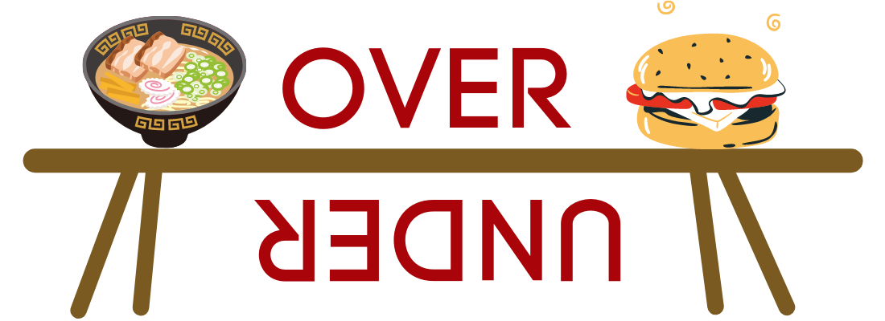

# Over and Under

**Demo Link**: https://mrmcpat.github.io/over-and-under

# Description

- Developed a recipe full stack web application that allows the user to select “Over” or “Under”. Depending on the selection, the user is able to search for recipes based off of the following fitness diet regimens: (Over: for bulking up and gaining muscle size. Under: for losing weight.)

- Used React.js/HTML/CSS with a simple json server database (fake REST API) to log favorite recipes.

- Users can also filter recipes based on protein, carb, calorie amount, meal type, cuisines, etc.

# GIFs

# Credits

Developed by Patrick Liang and Lynden Lim.